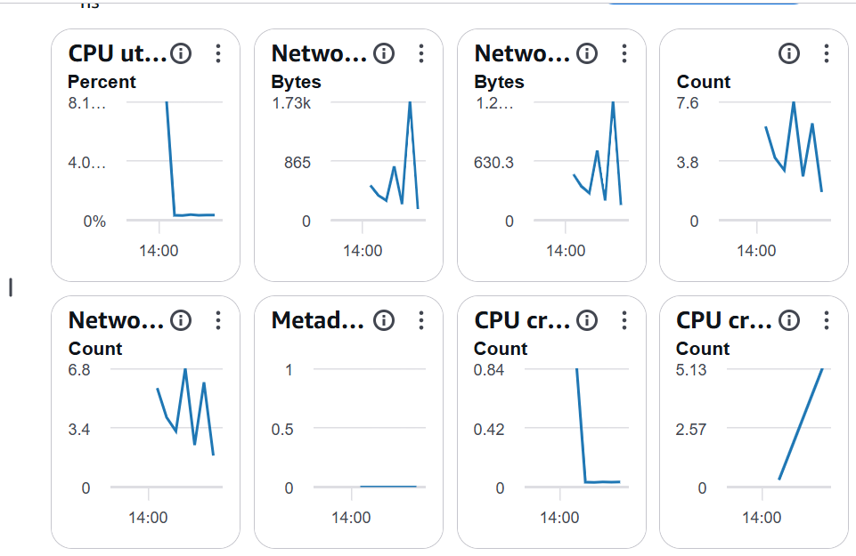
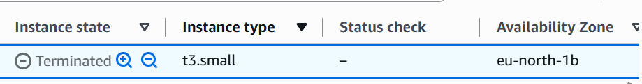

# Lab 01 — EC2 Web Server

## Overview

This lab is my first hands-on Amazon EC2 deployment as part of my AWS re/Start learning journey.

I launched, configured, monitored, secured, resized, protected, and terminated an EC2 instance while documenting what I learned at each stage.

---

## Objectives

* Launch an Amazon EC2 instance
* Understand Amazon Machine Images (AMIs)
* Configure an EC2 instance type
* Configure a security group
* Deploy a web server using User Data
* Monitor instance health
* Configure HTTP access
* Resize an EC2 instance
* Resize an EBS volume
* Configure termination protection
* Understand the EC2 instance lifecycle

---

## AWS Services

* Amazon EC2
* Amazon EBS
* Amazon CloudWatch
* AWS Security Groups

---

## Deployment

### EC2 Instance

The web server was deployed using Amazon EC2 with the following configuration:

| Configuration          | Value                     |
| ---------------------- | ------------------------- |
| Operating System       | Amazon Linux 2023         |
| Initial Instance Type  | t3.micro                  |
| Final Instance Type    | t3.small                  |
| Initial Storage        | 8 GiB gp3                 |
| Final Storage          | 10 GiB gp3                |
| Public IPv4            | Enabled                   |
| Security Group         | Web Server security group |
| Initial Inbound Rules  | None                      |
| Web Server             | Apache HTTP Server        |
| Termination Protection | Enabled during deployment |

### User Data

The EC2 instance was configured using User Data to automatically install and start Apache.

```bash
#!/bin/bash
yum -y install httpd
systemctl enable httpd
systemctl start httpd
echo '<html><h1>Hello From Your Web Server!</h1></html>' > /var/www/html/index.html
```

The User Data script allowed the web server to be configured automatically when the EC2 instance launched.

---

## Security Group Testing

### Initial Configuration

Initially, the security group had no inbound rules.

Although the EC2 instance was running and passed its health checks, the web server could not be reached through its public IP address.

This demonstrated that an EC2 instance can be running correctly while still being inaccessible from the internet because network traffic is being blocked by its security group.

### HTTP Rule

An inbound HTTP rule was then added to the security group:

| Setting  | Value         |
| -------- | ------------- |
| Protocol | TCP           |
| Port     | 80            |
| Source   | Anywhere-IPv4 |

Port 80 was opened to allow HTTP web traffic to reach the Apache web server.

### Result

After the HTTP rule was added, the web server became accessible through a web browser.

The browser successfully displayed:

> Hello From Your Web Server!

This demonstrated how security groups control inbound network traffic to an EC2 instance.

---

## Monitoring

The EC2 instance was monitored through the Amazon EC2 console.

### Instance Health

The instance successfully reached a running state and passed its available status checks.

AWS status checks help verify that the EC2 instance and the underlying AWS infrastructure are operating normally.

### Instance Screenshot

The EC2 console's **Get Instance Screenshot** feature was also used as part of the troubleshooting and monitoring process.

This provided a visual view of the instance's virtual display.

### CloudWatch Metrics

The **Monitoring** tab was used to review the instance's performance metrics, including:

* CPU utilization
* Network traffic
* Disk activity

Because the web server was only lightly used during the lab, the recorded resource utilization was relatively low.

Monitoring these metrics helps identify performance issues and understand how an EC2 instance is being used.

---

## Resizing

After completing the initial deployment and monitoring stages, the EC2 instance was resized.

### Instance Type

The instance was stopped before changing its instance type.

The configuration was changed from:

**`t3.micro → t3.small`**

This increased the compute resources available to the EC2 instance.

### EBS Volume

The attached EBS volume was also resized:

**`8 GiB gp3 → 10 GiB gp3`**

The volume type remained **gp3** while its storage capacity was increased.

### What I Learned

The EC2 instance type and EBS volume are separate resources.

* Changing the **instance type** changes the available compute resources.
* Increasing the **EBS volume size** increases available storage capacity.

This demonstrated that AWS resources can be adjusted as workload requirements change.

---

## Termination Protection

Termination protection was enabled when the EC2 instance was launched.

As part of the lab, I attempted to terminate the instance while termination protection was enabled.

The termination attempt was blocked.

This demonstrated how termination protection can help prevent accidental deletion of an EC2 instance.

After confirming that the protection worked, termination protection was disabled.

---

## Termination

After disabling termination protection, the EC2 instance was terminated successfully.

The instance progressed through the shutdown process and eventually reached the **Terminated** state.

This completed the EC2 instance lifecycle demonstrated in this lab:

**Launch → Run → Monitor → Secure → Resize → Protect → Terminate**

---

## What I Learned

* An EC2 instance is a virtual server running in AWS.
* An AMI provides the operating system and initial software environment for an EC2 instance.
* EC2 instance types determine the computing resources available to the virtual server.
* User Data can automate configuration tasks when an EC2 instance launches.
* Apache can be installed and started automatically using a User Data script.
* A security group acts as a virtual firewall controlling network traffic to an EC2 instance.
* A running EC2 instance can still be inaccessible if the required inbound traffic is not permitted.
* HTTP web traffic uses TCP port 80 by default.
* EC2 instance types can be changed to adjust compute capacity.
* EBS volumes can be expanded to provide additional storage.
* Termination protection can help prevent accidental deletion.
* Stopping and terminating an EC2 instance are different lifecycle actions.
* Termination permanently removes the EC2 instance.

---

## Challenges & Troubleshooting

### Web Server Initially Inaccessible

**Problem:**
The EC2 instance was running successfully, but the web page could not be reached through its public IPv4 address.

**Investigation:**
The security group initially had no inbound rules.

**Solution:**
An inbound HTTP rule allowing TCP traffic on port 80 from Anywhere-IPv4 was added.

**Result:**
The web server became accessible and displayed:

> Hello From Your Web Server!

This helped reinforce the relationship between an EC2 instance, its web server, and its security group.

### Termination Attempt Blocked

**Problem:**
The EC2 instance could not be terminated during the initial termination attempt.

**Investigation:**
Termination protection was enabled.

**Solution:**
Termination protection was intentionally disabled after confirming that it successfully prevented termination.

**Result:**
The EC2 instance was then terminated successfully.

---

## Screenshots

The following screenshots document the key stages of this hands-on EC2 deployment.

### 1. Starting Point

The AWS re/Start lab was adapted for a personal AWS account, allowing the same learning objectives to be practiced independently.

### 2. Lab Documentation

The lab was documented in GitHub as part of my AWS learning journey.

### 3. Launching the EC2 Instance

The EC2 instance was configured using Amazon Linux 2023 and the initial `t3.micro` instance type.

### 4. Selecting the Instance Type

The initial instance type selected was `t3.micro`.

### 5. EC2 Instance Running

The instance successfully launched and passed its available status checks.


### 6. Testing Before HTTP Access

Before adding an HTTP rule to the security group, the web server could not be reached through its public IP address.


### 7. Web Server Successfully Accessible

After allowing HTTP traffic on TCP port 80, the Apache web server successfully displayed the test page.


### 8. EC2 Instance Screenshot

The EC2 console's instance screenshot feature was used as part of the monitoring and troubleshooting process.


### 9. EC2 Monitoring

The Monitoring tab was used to review the instance's performance metrics.



### 10. Instance Type Changed

The EC2 instance was resized from `t3.micro` to `t3.small`.


### 11. EBS Volume Changed

The attached EBS volume was resized from `8 GiB` to `10 GiB`.


### 12. Termination Protection

An initial termination attempt was blocked because termination protection was enabled.


### 13. Termination Protection Removed

Termination protection was disabled after confirming that it successfully prevented accidental termination.


### 14. EC2 Instance Terminated

After termination protection was disabled, the EC2 instance was successfully terminated, completing the lab.



---

## Lab Reflection

This lab gave me my first practical experience working with Amazon EC2.

One of the most important lessons was that successfully launching a server is only one part of deploying a web application. Network access, monitoring, compute resources, storage, and protection mechanisms all play an important role.

The security group troubleshooting was particularly useful because the EC2 instance itself was healthy, but the website was inaccessible until the correct HTTP rule was added.

The lab also helped me understand the difference between stopping, resizing, protecting, and terminating an EC2 instance.

---

## Status

🟢 Complete

**Completed:** September 2026
